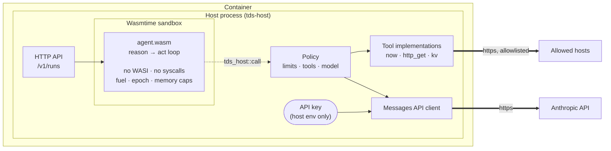

# tds-wasm-ai

A containerized WebAssembly runtime that encapsulates an AI agent.

The agent is compiled to a `wasm32-unknown-unknown` module and run under
[Wasmtime](https://wasmtime.dev). It has **no WASI, no syscalls, and no ambient
authority of any kind** — it cannot open a socket, read a file, or even read the
clock. Everything it does to or observes about the outside world goes through
three host functions, and every one of those calls is checked against a policy
the agent cannot read or influence.

That includes the model itself. The agent asks for a completion; the host
decides which model answers, with which credentials, at which endpoint. **The
API key is read from the host environment and never enters guest memory.**

---

## Why put an agent in a Wasm sandbox

An agent is a program that decides at runtime what to do next, partly on the
basis of text it did not write — web pages, tool output, documents. Prompt
injection is not an exotic failure mode for that design; it is the expected one.
The useful question is not "can the agent be talked into trying something", but
"what happens when it does".

Here, the answer is bounded by construction rather than by the agent's judgment:

| The agent tries to… | What happens |
|---|---|
| Reach a host that is not on the allowlist | Denied by the host, before any connection is made |
| Use a tool the policy did not enable | The tool is not described to the model, not listed, and refused if requested anyway |
| Read the API key | There is nothing to read: the key lives in the host process |
| Read or write a file | No filesystem exists inside the sandbox |
| Loop forever | Stopped by the fuel budget, or by epoch interruption if it never calls back |
| Allocate without bound | Stopped by the linear-memory ceiling |
| Keep calling the model | Stopped by the host's own turn counter, not the agent's |
| Leave state behind for the next run | Every run gets a fresh instance, fresh memory, fresh scratchpad |

A denial is not a crash. It comes back as an ordinary error result the model can
read and work around, so the agent can explain what it would have needed instead
of failing opaquely.

---

## Architecture



The dotted arrow is the only path out of the sandbox. Everything on the right of
it is host code the guest cannot reach directly.

### Crates

| Crate | What it is |
|---|---|
| `tds-abi` | The host/guest contract: capability envelopes, message and tool types, pointer packing. Shared by both sides so they cannot drift. |
| `tds-agent` | The agent. Compiles to WebAssembly; imports only `tds_host::{log, call, response_read}`. |
| `tds-host` | The runtime: Wasmtime engine, policy enforcement, tool implementations, Messages API client, CLI, and HTTP server. |

---

## Quick start

No API key needed for this — the `mock` policy uses a deterministic offline
model that drives the agent loop from directives in the task text.

```bash
make build

./target/release/tds-host run \
  --agent crates/tds-agent/target/wasm32-unknown-unknown/release/tds_agent.wasm \
  --policy policy/mock.toml \
  --task 'Checkpoint the run and report the time.
!tool now {}
!tool kv_put {"key":"stage","value":"one"}'
```

```
[mock] Tool results: 2026-08-17T19:15:43Z | stored "checkpoint"

— Completed after 2 step(s) in 13 ms via mock (fuel 296333, tokens 220/50)
  step 1 · now · ok
  step 1 · kv_put · ok
```

### Against a real model

```bash
export ANTHROPIC_API_KEY=sk-ant-...

./target/release/tds-host run \
  --agent crates/tds-agent/target/wasm32-unknown-unknown/release/tds_agent.wasm \
  --policy policy/default.toml \
  --task 'Save a note about what you can and cannot reach from in here, then summarize it.'
```

`policy/default.toml` targets `claude-opus-5` with adaptive thinking at `high`
effort, and enables only the `now` and key/value tools. To let the agent read
the web, add `http_get` to `tools.enabled` and name the hosts it may reach:

```toml
[tools]
enabled = ["now", "kv_get", "kv_put", "http_get"]

[tools.http]
allowed_hosts = ["api.github.com", "*.python.org"]
```

### In a container

```bash
make docker

docker run --rm -p 8080:8080 \
  --read-only --cap-drop ALL --security-opt no-new-privileges \
  -e ANTHROPIC_API_KEY \
  tds-wasm-ai:dev serve
```

Or `docker compose up`, which applies the same hardening plus CPU and memory
ceilings. The container writes nothing to disk, runs as an unprivileged user,
and drops every capability — a second boundary underneath the sandbox, not a
replacement for it.

---

## HTTP API

```
GET  /healthz     liveness
GET  /v1/policy   the effective policy (credential *names* only, never values)
POST /v1/runs     run one task
```

```bash
curl localhost:8080/v1/runs -H 'content-type: application/json' -d '{
  "task": "Summarize the last three releases of the project.",
  "max_steps": 5
}'
```

The response is the full run report: the answer, why the loop stopped, every
tool call with its arguments and whether it succeeded, token usage, fuel
consumed, wall-clock duration, and the agent's log lines. It is meant to be
auditable after the fact, not just readable.

`max_steps` is a request, not a grant — it is clamped to the policy's ceiling.

---

## Policy

Everything the agent is allowed to consume and reach, in one file. See
[`policy/default.toml`](policy/default.toml) for the annotated version.

```toml
[limits]
fuel              = 1_000_000_000   # guest compute budget
wall_clock_ms     = 180_000         # total run budget, model latency included
memory_bytes      = 67_108_864      # linear memory ceiling
table_elements    = 10_000
max_steps         = 8               # model turns, enforced host-side
max_request_bytes = 4_194_304       # largest single capability request

[llm]
provider              = "anthropic"           # or "mock" for offline runs
model                 = "claude-opus-5"
max_tokens            = 8192
effort                = "high"                # low | medium | high | xhigh | max
thinking              = "adaptive"
summarize_thinking    = false
api_key_env           = "ANTHROPIC_API_KEY"   # the name; never the value
server_side_fallback  = true

[tools]
enabled = ["now", "kv_get", "kv_put"]

[tools.http]
allowed_hosts      = []                       # empty reaches nothing
max_response_bytes = 65_536
```

A few details worth knowing:

- **Invalid combinations fail at startup, not mid-run.** `thinking = "disabled"`
  is only valid at `effort` of `high` or lower, so the host refuses to start
  rather than 400ing on someone's first request.
- **Host matching is exact or a `*.` suffix**, never a substring — a rule for
  `example.com` does not admit `evil-example.com`.
- **Redirects are not followed.** The destination of a redirect has not been
  checked against the allowlist, so the agent gets the `Location` back and can
  fetch it explicitly, which re-runs the check.
- **`server_side_fallback` is on by default.** A benign request that trips a
  safety classifier is re-run on a recommended fallback model inside the same
  call, instead of just stopping.

`tds-host check` validates a policy and the agent module without running
anything, and confirms the model credential is present — which is why it doubles
as the container's healthcheck. Add `--offline` to check a policy on a machine
that has no key.

---

## The ABI

The guest exports:

| Export | Signature | Purpose |
|---|---|---|
| `tds_abi_version` | `() -> i32` | Handshake; the host refuses a mismatch |
| `tds_alloc` | `(i32) -> i32` | Allocate guest memory |
| `tds_dealloc` | `(i32, i32)` | Free it |
| `tds_run` | `(i32, i32) -> i64` | Run the agent; returns a packed pointer/length |

The host provides exactly three functions, in the module `tds_host`:

| Import | Signature | Purpose |
|---|---|---|
| `log` | `(i32, i32, i32)` | A log line at a severity level |
| `call` | `(i32, i32, i32, i32) -> i32` | Invoke a capability; returns response length |
| `response_read` | `(i32, i32) -> i32` | Copy the pending response into guest memory |

Capabilities are named strings: `tools.list`, `tool.invoke`, `llm.complete`.
Every call returns a JSON envelope that is either a result or a structured
error, so a denial is something the agent handles rather than something that
kills it.

**The host verifies the module's shape before running it.** A module that
imports anything else — WASI, some other host's functions — is rejected at load
time. That is what makes "no ambient authority" a property of the runtime rather
than a promise about how the guest happened to be compiled.

### Writing your own agent

The agent is just a program that speaks this ABI. `crates/tds-agent` implements
a reason-and-act loop, but nothing about the host assumes that; swap in a
planner, a router, or a workflow and the same sandbox and policy apply
unchanged. Any language that targets `wasm32-unknown-unknown` will do.

---

## Development

```bash
make build   # agent + host
make test    # unit + integration tests, no network, no API key
make lint    # clippy -D warnings, rustfmt
make check   # validate policy and module
make serve   # HTTP server on :8080
```

A GitHub Actions workflow — build, lint, test, plus a container smoke test — is
in [`ci/github-workflow.yml`](ci/github-workflow.yml). Move it to
`.github/workflows/ci.yml` to enable it.

The integration tests in `crates/tds-host/tests/sandbox.rs` run the real agent
module under the real runtime with a scripted model, and assert on the boundary
itself: that a WASI import is refused, that a spinning module is stopped by its
fuel budget, that the host's turn ceiling binds when the caller asks for more,
that a denial reaches the agent as a readable error, and that no state survives
between runs.

---

## What this does and does not protect against

**Bounded by the sandbox.** Network reach, filesystem access, credential
exposure, compute and memory exhaustion, unbounded model spend, and state
crossing between runs. These hold regardless of what the agent's code does or
what any text it reads tells it to do.

**Not bounded by the sandbox.** The agent can still do anything the policy
permits — that is the point of the policy. If you enable `http_get` for a host,
an injected instruction can cause a request to that host with attacker-chosen
content in the path or query. Scope allowlists to what the task actually needs.

Two more things worth being explicit about:

- **Data the model returns is not filtered.** Tool output flows back into the
  conversation as-is. Treat model output as untrusted input to whatever consumes
  it downstream.
- **The wall-clock budget covers model latency.** A slow model turn spends the
  same budget a runaway loop would. Size `wall_clock_ms` for the slowest turn
  you expect at your chosen effort level, not just for guest compute.

---

## License

Apache-2.0
